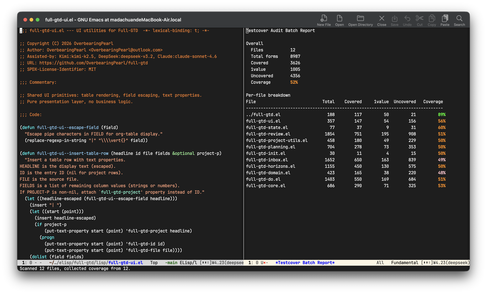

# testcover-audit

**Testcover Audit** adds quantitative coverage statistics to Emacs' built-in `testcover.el`. It shows coverage percentage, counts of covered / uncovered / 1value forms, and can generate per-file and per-function breakdowns.



## Quick start

<pre>
┌───────────────┐   ┌───────────────┐   ┌─────────────────┐
│ 1. instrument │──▶│ 2. run tests  │──▶│ 3. view report  │
└───────────────┘   └───────────────┘   └─────────────────┘
</pre>

```elisp
M-x testcover-audit-instrument-directory RET /path/to/project
M-x ert RET t
M-x testcover-audit-project-report
```

To see the current buffer's coverage percentage in the mode line, enable `testcover-audit-mode`. The `show-*` commands are available as soon as the source buffer is instrumented and tests have run.

## Features

- Mode-line coverage percentage for the current buffer.
- Per-file, per-function, and aggregate batch reports.
- Directory scanning and one-command instrumentation.
- Org/JSON export and CI threshold enforcement.
- project.el and ERT integration.

## Installation

### From MELPA

```elisp
M-x package-install RET testcover-audit RET
```

### Manual

Clone the repository and add both the project root and `lisp/` subdirectory to `load-path`:

```elisp
(add-to-list 'load-path "/path/to/testcover-audit")
(add-to-list 'load-path "/path/to/testcover-audit/lisp")
(require 'testcover-audit)
```

## Usage

### The three-step model

testcover-audit only reads coverage data produced by `testcover`. It does not instrument code itself. Every workflow follows the same three steps:

1. **Instrument** source files with `testcover-start`, or use `testcover-audit-instrument-directory`.
2. **Run your tests** so the instrumented code is actually executed.
3. **View** coverage. The `show-*` commands read live coverage directly from the current buffer's testcover-instrumented definitions. For project-wide reports, run `testcover-audit-project-report`, or first `testcover-audit-scan-directory` and then `testcover-audit-batch-report`.

Keep instrumented source buffers open while viewing coverage, because live testcover data is read from the testcover-instrumented definitions in those buffers.

### Project workflow

```elisp
;; 1. Instrument all source files once.
M-x testcover-audit-instrument-directory RET /path/to/project

;; 2. Run your project's tests.
M-x ert RET t

;; 3. Collect data and show the aggregate report.
M-x testcover-audit-project-report
```

`testcover-audit-project-report` scans the current project root and then displays a batch report. If you only need data collection, use `testcover-audit-scan-directory` directly.

### Command summary

| Command | Purpose |
|---------|---------|
| `testcover-audit-show-stats` | Coverage % for the current buffer in the echo area (live data). |
| `testcover-audit-show-all-stats` | Detailed color-coded report for the current file (live data). |
| `testcover-audit-show-function-stats` | Per-function breakdown for the current file (live data). |
| `testcover-audit-batch-report` | Aggregate report for all scan-collected files. |
| `testcover-audit-scan-directory` | Collect a coverage snapshot from open, instrumented buffers under a directory. |
| `testcover-audit-project-report` | Scan the current project and show aggregate report. |
| `testcover-audit-instrument-directory` | Instrument source files under a directory with `testcover-start`. |
| `testcover-audit-export-org` | Export the aggregate report to an Org file. |
| `testcover-audit-export-json` | Export the aggregate report to a JSON file. |
| `testcover-audit-ci-check` | Fail when collected coverage is below `testcover-audit-ci-threshold`. |
| `testcover-audit-ert-mode` | Automatically show a report after each ERT run. |

### Export reports

```elisp
M-x testcover-audit-export-org RET /tmp/coverage.org
M-x testcover-audit-export-json RET /tmp/coverage.json
```

Exports use only the snapshot collected by `testcover-audit-scan-directory`. Without a collected snapshot they fail with `No coverage data available`.

### CI usage

`testcover-audit-ci-check` is designed for batch mode. A naive `emacs --batch ... -f testcover-audit-scan-directory` invocation does **not** work: in batch mode nothing opens or instruments source files. Use a small script instead. Save this as `ci-coverage.el`:

```elisp
;;; ci-coverage.el --- Run project coverage in CI. -*- lexical-binding: t; -*-
(require 'ert)
(require 'testcover-audit)
(setq testcover-audit-ci-threshold 80)

(let* ((root "/path/to/project")
       (all (directory-files-recursively root "\\.el$")))
  ;; 1. Load and instrument every non-test .el file.
  (dolist (file all)
    (unless (string-match-p "-test\\.el$" file)
      (with-current-buffer (find-file-noselect file)
        (require 'testcover)
        (testcover-start (buffer-file-name)))))
  ;; 2. Load and run the test files.
  (dolist (file all)
    (when (string-match-p "-test\\.el$" file)
      (load-file file)))
  (let ((result (ert-run-tests-batch t)))
    ;; 3. Collect data and enforce the coverage threshold.
    (testcover-audit-scan-directory root)
    (unless testcover-audit--loaded-files
      (error "No coverage data collected - did you run testcover-start?"))
    (testcover-audit-ci-check)
    ;; 4. Test failures must also fail CI.
    (when (> (ert-stats-completed-unexpected result) 0)
      (kill-emacs 3))))
```

Run it with:

```sh
emacs -Q --batch -L . -L lisp -l ci-coverage.el
```

### ERT integration

```elisp
(setq testcover-audit-auto-show-report t
      testcover-audit-ert-scan-directory "/path/to/project")
(testcover-audit-ert-mode 1)
```

After each ERT run, the configured directory is scanned first and a coverage report is automatically shown when `testcover-audit-auto-show-report` is non-nil.

### Customization

`M-x customize-group RET testcover-audit RET`

| Option | Default | Description |
|--------|---------|-------------|
| `testcover-audit-green-threshold` | 80 | Coverage % at/above which the report is green. |
| `testcover-audit-yellow-threshold` | 50 | Coverage % below which the report is red. |
| `testcover-audit-report-format` | `table` | Report format: `table` or `list`. |
| `testcover-audit-exclude-files` | `("^\\." "\\.elc$")` | Regexps for excluding files from directory scans. |
| `testcover-audit-test-file-regexp` | `\\(?:\\`\\|[-_]\\)test\\.el\\'` | Regexp matching test files excluded from source coverage. |
| `testcover-audit-auto-show-report` | `nil` | Automatically display the report after ERT runs. |
| `testcover-audit-ert-scan-directory` | `nil` | Directory scanned before automatic ERT reports. |
| `testcover-audit-ci-threshold` | 80 | Minimum coverage % required by `testcover-audit-ci-check`. |

## How scanning works

- The `show-*` commands (`show-stats`, `show-all-stats`, `show-function-stats`) read live testcover data directly from the current buffer; they do not require a scan.
- `testcover-audit-scan-directory` collects a snapshot from open, instrumented buffers into `testcover-audit--loaded-files` for batch/export/CI commands. It never calls `testcover-start` and never loads files.
- Files that are not open, have dead buffers, or contain no testcover-instrumented definitions are skipped. When any files are skipped, the scan message reports the reason counts.
- Test files are excluded by default; set `testcover-audit-test-file-regexp` to `nil` to include them.

## Notes

- This package only works on files that have been instrumented with `testcover-start`.
- Report colors are based on the current buffer's `default` face, so they integrate well with your theme.
- Keep instrumented source buffers open while viewing live `show-*` reports. Batch/export/CI commands use the snapshot collected by `testcover-audit-scan-directory` or `testcover-audit-project-report`.

## License

GPL-3.0-or-later, see `LICENSE` file.
